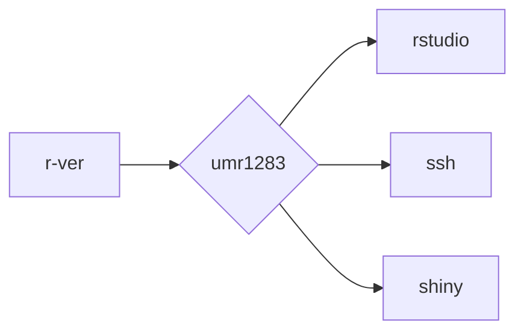

<!-- README.md is generated from README.Rmd. Please edit that file -->

```{r, include = FALSE}
knitr::opts_chunk$set(
  collapse = TRUE,
  comment = "#>"
)
```

# Version-stable Docker Images

<!-- badges: start -->
[](LICENSE)
[](https://github.com/mcanouil/docker-versioned)
[](https://github.com/mcanouil/docker-versioned/actions/workflows/weekly.yml)  
[](https://github.com/mcanouil/docker-versioned/actions/workflows/core.yml)
[](https://github.com/mcanouil/docker-versioned/actions/workflows/umr.yml)
<!-- badges: end -->

This is a repository for building automatically Docker images for R >= 4.0.0.

```{r, echo = FALSE, results = "asis"}
dt <- do.call("rbind", lapply(
  X = jsonlite::read_json(here::here("01-stacks/devel.json"))$stack,
  FUN = function(x) {
    img <- x$labels$org.opencontainers.image.title
    rver <- sprintf(
      "[](https://hub.docker.com/r/%s)",
      img, img
    )
    desc <- x$labels$org.opencontainers.image.description
    c(
      sprintf("[%s](https://hub.docker.com/r/%s)", basename(img), img),
      desc,
      rver,
      sprintf("[](https://hub.docker.com/r/%s)", img, img)
    )
  }
))
colnames(dt) <- c("Image", "Description", "R", "Pull")
knitr::kable(dt, format = "markdown")
```



_Note: Based on [rocker-org/rocker-versioned2](https://github.com/rocker-org/rocker-versioned2) build workflow._
