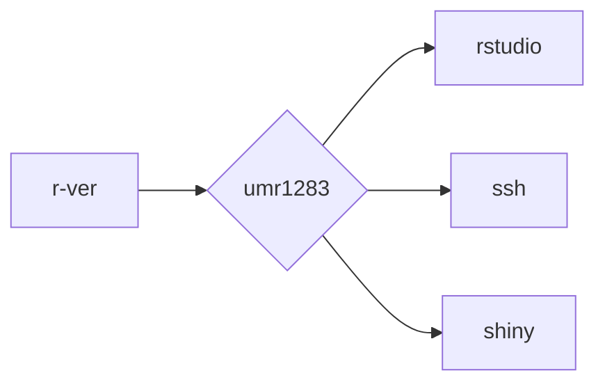

<!-- README.md is generated from README.Rmd. Please edit that file -->

# Version-stable Docker Images

<!-- badges: start -->

<!-- badges: end -->

This is a repository for building automatically Docker images for R \>=
4.0.0.

| Image                                                | Description                                                                |
|:-----------------------------------------------------|:---------------------------------------------------------------------------|
| [r-ver](https://github.com/mcanouil/docker-versioned/pkgs/container/r-ver)     | Reproducible builds with predefined version of R                           |
| [umr1283](https://github.com/mcanouil/docker-versioned/pkgs/container/umr1283) | Reproducible builds with predefined version of R and some (genetics) tools |
| [rstudio](https://github.com/mcanouil/docker-versioned/pkgs/container/rstudio) | RStudio server for umr1283 image                                           |
| [ssh](https://github.com/mcanouil/docker-versioned/pkgs/container/ssh)         | SSH server for umr1283 image                                               |
| [shiny](https://github.com/mcanouil/docker-versioned/pkgs/container/shiny)     | Shiny server for umr1283 image                                             |

*Note: Based on
[rocker-org/rocker-versioned2](https://github.com/rocker-org/rocker-versioned2)
build workflow.*
